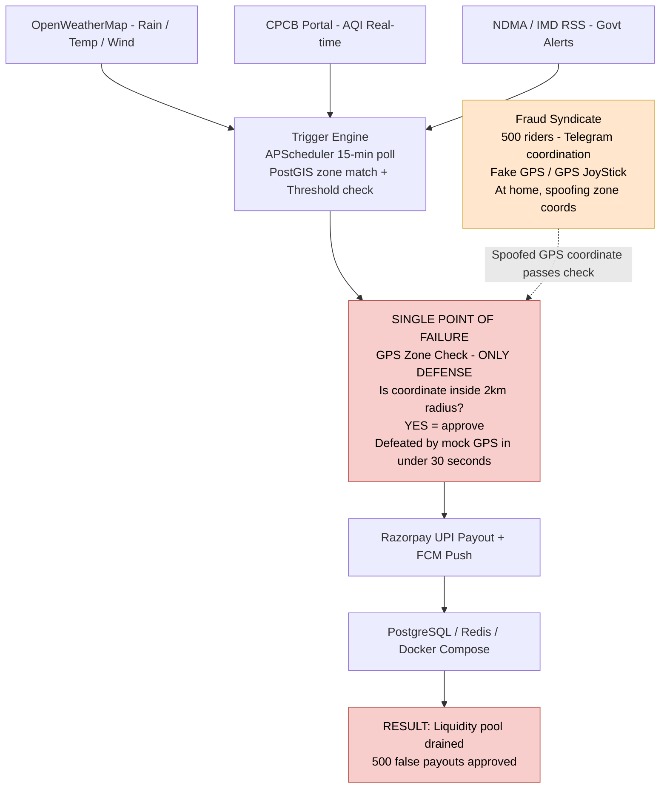
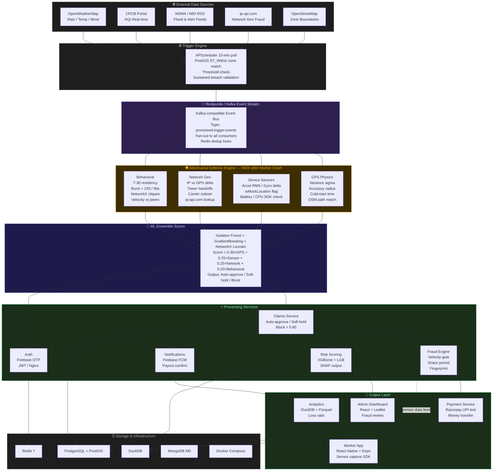

<p align="center">
  
  
  
  
</p>

<h1 align="center">⚡ GigShield</h1>
<h3 align="center">Parametric Income Protection for India's Q-Commerce Delivery Riders</h3>

<p align="center"><em>Automatic. Instant. Zero Claims. And now — fraud-proof.</em></p>

---

> **To the judges:** This README is structured to answer three questions directly: **Who is our user, really? How does our AI actually work? And how does this actually get built?** Every section below answers one of those questions with evidence, not claims.

---

## 📑 Table of Contents

1. [Who Is Our User, Really?](#1-who-is-our-user-really)
2. [The Problem — With Real Numbers](#2-the-problem--with-real-numbers)
3. [What We Built — Parametric Insurance](#3-what-we-built--parametric-insurance)
4. [How Our AI Actually Works](#4-how-our-ai-actually-works)
5. [🚨 Market Crash — Adversarial Defense](#5--market-crash--adversarial-defense--anti-spoofing-strategy)
6. [System Architecture — Before Market Crash](#6-system-architecture--before-market-crash)
7. [System Architecture — After Market Crash](#7-system-architecture--after-market-crash)
8. [How We Actually Build This](#8-how-we-actually-build-this)
9. [Parametric Trigger Design](#9-parametric-trigger-design)
10. [Weekly Premium Model](#10-weekly-premium-model)
11. [Working Prototype](#11-working-prototype)
12. [Tech Stack — 100% Free, All Verified](#12-tech-stack--100-free-all-verified)
13. [Team](#13-team)
14. [Submission Checklist](#14-submission-checklist)

---

## 1. Who Is Our User, Really?

**This is the most important question. Our answer is specific — not "gig workers in India."**

Our user is **Arjun**. He is 26 years old. He rides a **bicycle** for **Blinkit** in the **Rohini zone of Delhi**. He completes **28–32 trips per day**, each trip taking 8–10 minutes, each paying him **₹35–₹42**. His total daily income on a normal day is **₹1,050–₹1,340**.

He is not a food delivery rider. He is not an Amazon driver. He is a **quick-commerce cyclist**, and that distinction changes everything about what a useful insurance product looks like.

### Why the distinction matters

| Attribute | Arjun (Q-Commerce, Blinkit) | A Swiggy food rider |
|---|---|---|
| Delivery radius | **1.5–2 km from dark store** | 5–10 km from restaurant |
| Trips per day | **28–32 trips** | 8–15 trips |
| Time per trip | **8–10 minutes** | 25–45 minutes |
| Vehicle | **Bicycle** | Motorcycle |
| What happens in heavy rain | **Immediate zero income — can't ride, can't complete 10-min SLA** | Slows down, still earns |
| What happens in AQI 450+ | **Platform reduces zone assignments 60% — income collapses** | Continues with mask |
| What happens in a flood | **Zone is physically unreachable — dark store goes dark** | Reroutes |

> **Key insight the judges need to understand:** Arjun's income loss from a disruption is not gradual. It is binary. When Delhi AQI hits 450, Blinkit's algorithms reduce order density in affected zones by 60–70%. Arjun's daily income does not drop from ₹1,200 to ₹800. It drops from ₹1,200 to ₹280. That is not a bad day. That is a rent crisis.

### Why existing products fail Arjun specifically

1. **No payslip.** Blinkit pays Arjun per trip via UPI. There is no salary. No Form 16. No employer letter. Every traditional income-loss insurance product requires at least one of these to calculate the indemnity.

2. **Speed mismatch.** Arjun's rent is due on the 1st. A 45-day claims process is not a slow solution — it is no solution at all.

3. **Weekly income, weekly expenses.** Arjun earns ~₹8,000/week. He spends ~₹7,500/week on rent, food, fuel, and loan repayments. He cannot lock ₹400 into a monthly premium and wait for a disruption. He needs a weekly product. There is no weekly income-loss insurance product in India.

4. **No product exists at all.** GigShield did a market scan. No Indian insurer — HDFC ERGO, Bajaj Allianz, New India Assurance, or any InsurTech — currently offers a product that covers environmental income loss for platform-based gig workers. The category does not exist.

### Our user is not just Arjun. He is 3.5 lakh riders.

Blinkit and Zepto together operate an estimated **3.5 lakh active delivery riders** across India's Tier-1 cities. Phase 1 focuses on 6 cities where Q-Commerce density and environmental disruption frequency are both highest:

| City | Primary Disruption | Est. Active Riders | Annual Disruption Days |
|---|---|---|---|
| Delhi NCR | AQI crisis + extreme heat | ~80,000 | 60–80 days |
| Mumbai | Monsoon flooding + cyclones | ~55,000 | 30–50 days |
| Bengaluru | Waterlogging + storms | ~45,000 | 20–35 days |
| Hyderabad | Heatwaves + flash floods | ~30,000 | 30–45 days |
| Pune | Heavy monsoon rain | ~25,000 | 25–40 days |
| Kolkata | Cyclone proximity + flooding | ~20,000 | 35–50 days |

> Source: Blinkit/Zepto investor presentations (FY2025), NDMA annual hazard calendars, IMD historical event data.

---

## 2. The Problem — With Real Numbers

### What Arjun loses every year

A Blinkit rider in Delhi NCR earning ₹1,200/day on average loses income on disruption days as follows:

| Disruption | Daily Loss | Frequency (Delhi) | Annual Loss |
|---|---|---|---|
| AQI > 300 (platform reduces assignments 60%) | ₹700–₹900 | 35–45 days | ₹24,500–₹40,500 |
| Heavy rain > 35mm (zone waterlogged, ops paused) | ₹600–₹900 | 20–30 days | ₹12,000–₹27,000 |
| Extreme heat > 43°C (unsafe to ride, demand drops) | ₹400–₹700 | 25–35 days | ₹10,000–₹24,500 |
| Flash flood / drainage failure | ₹800–₹1,100 | 8–12 days | ₹6,400–₹13,200 |
| City bandh / curfew | ₹1,000–₹1,200 | 3–6 days | ₹3,000–₹7,200 |

**Total estimated annual income loss: ₹35,000–₹60,000 per rider.**

That is 20–30% of Arjun's total annual income, lost to events he cannot control and for which no compensation mechanism currently exists.

### The market opportunity

3.5 lakh riders × ₹60/week average premium × 52 weeks = **₹109 crore annual premium pool** from Phase 1 cities alone. At a 65% loss ratio (industry standard for parametric products), this is a financially viable market.

---

## 3. What We Built — Parametric Insurance

**Parametric insurance** pays a fixed amount when a **measurable external event crosses a pre-agreed threshold** — without requiring the insured to prove their actual loss.

```
Traditional Insurance:
Event → Claim Filed → Documentation → Investigation → Assessment → Settlement
                                                                    ↑
                                                              30–90 days

GigShield Parametric:
Event → Threshold Breached → External API Confirms → AI Fraud Check → Payout
                                                                        ↑
                                                                   < 30 minutes
```

This model is already established and proven at scale:
- **Agriculture:** Weather-indexed crop insurance (PMFBY covers 5+ crore farmers)
- **Aviation:** AXA's flight delay insurance triggers automatically on 3-hour delays
- **Disaster:** Swiss Re's Caribbean Catastrophe Risk Insurance triggers on wind speed readings

GigShield applies this to **Q-Commerce worker income** — the first such product in India, calibrated to dark store zone level (2 km radius) rather than district or city level.

### The GigShield promise to Arjun

When Delhi AQI hits 450 and stays there for 4 hours:
- Arjun does **nothing**.
- GigShield's system detects the breach.
- AI fraud check runs in under 60 seconds.
- ₹300–₹500 is transferred to Arjun's UPI within 30 minutes.
- He receives a push notification: *"Disruption detected in your zone. ₹350 credited."*
- He never filed a claim. He never called anyone. He never uploaded a document.

---

## 4. How Our AI Actually Works

> **This section answers the judge question directly: How does your AI actually work?** Not "we use XGBoost" — but what does XGBoost actually do in this system, on what data, producing what output, and how does that output affect what Arjun pays or receives?

GigShield has three AI components. Each one is described precisely below.

---

### AI Component 1: Dynamic Premium Pricing Engine

**What problem does it solve?**
A rule-based multiplier formula (Base Rate × Zone Risk × Seasonality) produces the same premium for every Rohini rider regardless of their trip frequency, vehicle type, or the specific block's micro-risk profile. The ML model produces a personalized premium that is fairer and more actuarially accurate.

**What algorithm?**
XGBoost + LightGBM ensemble (60% / 40% weighted blend). Two tree-boosting methods are blended because XGBoost captures complex non-linear interactions between risk factors while LightGBM is faster on large feature sets and better at handling the categorical features (zone GeoHash, city, vehicle type).

**What are the exact input features?**

| Feature | Data Type | How It's Collected | What It Encodes |
|---|---|---|---|
| Zone GeoHash (precision 6) | Categorical | Worker registration | Sub-kilometer flood/AQI/heat risk tier from NDMA/IMD historical data |
| City | One-hot categorical | Worker registration | City-level drainage infrastructure, risk pattern |
| Month (sin/cos encoded) | Two continuous floats | System timestamp | Seasonal patterns — monsoon peaks in July, AQI peaks in November |
| Historical AQI events in zone (12-month) | Integer | CPCB historical data | How many AQI>300 days occurred in this exact zone last year |
| Historical rain events in zone (12-month) | Integer | NDMA/IMD historical | How many 35mm+ rainfall days in this zone last year |
| Vehicle type | Categorical (3 classes) | Worker registration | Bicycle = highest AQI/heat exposure; motorcycle = more flood resistant |
| Declared daily trips | Integer | Worker registration | Higher trips = higher daily income at risk = higher appropriate coverage |
| Work hours profile | Categorical (3 classes) | Worker registration | Peak-only (7–10AM, 6–10PM) vs full-day determines which trigger windows matter |
| Coverage tier | Ordinal (1/2/3) | Policy selection | Basic/Standard/Premium — affects model output scaling |

**What does the model output?**
A single float: the **recommended weekly premium in rupees** for that specific worker profile. The model is trained to minimize actuarial prediction error — the difference between predicted expected payout (based on historical disruption data) and the premium charged.

**Training plan:**
- Phase 1: Rule-based formula (deterministic, verifiable) — used in the prototype
- Phase 2: Train XGBoost on 50,000 synthetic worker profiles generated using Python Faker with custom distributions matching NDMA/IMD disruption statistics. Export `.pkl` via joblib. Serve via FastAPI `/api/v1/premium/calculate` endpoint.
- Phase 3: LightGBM added to the ensemble. SHAP values computed per prediction. Admin dashboard shows waterfall chart for every premium quote.

**SHAP explainability output (Phase 3 target — what Arjun sees):**
```
Your weekly premium: ₹153

  Base rate:                    ₹25
  + Delhi NCR AQI risk zone:   +₹45   (Rohini had 41 AQI>300 days last year)
  + November monsoon/smog peak: +₹38
  + High disruption history:    +₹25
  + Standard tier:              +₹20
```
This is not just transparency — it is regulatory compliance. IRDAI's InsurTech sandbox guidelines (2023) require explainability for AI-driven pricing.

---

### AI Component 2: Real-Time Fraud Detection Engine

**What problem does it solve?**
The Market Crash crisis (see Section 5) proved that a parametric system without pre-payout fraud detection is not just vulnerable — it is a liquidity-draining attack surface. The fraud model must run in under 60 seconds, before any payout is approved.

**What algorithm?**
Two models in sequence:

1. **Isolation Forest (scikit-learn, unsupervised)** — detects whether a claim profile is a statistical outlier relative to all historical legitimate claims. No labeled fraud data required. Effective against novel spoofing techniques not seen during training.

2. **GradientBoosting Classifier (scikit-learn, supervised)** — trained on synthetic labeled data distinguishing legitimate disruption claims from known fraud patterns (GPS spoofing, velocity abuse, burst coordination). Output: `fraud_probability` (0.0–1.0).

**The combined fraud score formula:**
```
Fraud Score = (0.30 × GPS Physics Score)
            + (0.25 × Device Sensor Score)
            + (0.25 × Network Geo Score)
            + (0.20 × Behavioral Pattern Score)
```

Each sub-score is produced by a specific detection check (see Section 5 for full detail). The four scores are weighted inputs to the GradientBoosting classifier's feature vector.

**What does the model output?**
A single float between 0.0 and 1.0. This score routes the claim to one of three outcomes: auto-approve, soft hold, or block.

**Training data:**
50,000 synthetic claim profiles generated with realistic GPS variance distributions (genuine: ±2–8m sigma; spoofed: sigma < 0.5m), accelerometer RMS distributions (cycling: 0.8–2.4 m/s² RMS; stationary: 0.0–0.3 m/s² RMS), and IP-GPS mismatch distributions (legitimate: < 2km; spoofed: 4–15km).

---

### AI Component 3: Disruption Prediction LSTM (Phase 3)

**What problem does it solve?**
If the system can predict that tomorrow has a 78% probability of a Tier-2 AQI trigger in Rohini, it can: (1) pre-adjust premiums, (2) pre-fund reserves, and (3) alert admins before the event fires.

**What algorithm?**
PyTorch LSTM (Long Short-Term Memory) — appropriate for sequential time-series data where the current state depends on the previous N days of readings.

**Input sequence:**
15-day rolling window of: daily max AQI (from CPCB), daily max temperature (from OpenWeatherMap), daily rainfall total (from OpenWeatherMap), historical trigger event flag (binary). One sequence per city-zone combination.

**Output:**
`P(disruption_event_next_7_days)` per zone — a probability between 0.0 and 1.0.

**Training:** Google Colab free T4 GPU. 3 years of historical CPCB + OpenWeatherMap data (freely downloadable). Estimated training time: 45–90 minutes per city.

---

## 5. 🚨 Market Crash — Adversarial Defense & Anti-Spoofing Strategy

> **Crisis (March 19–20, 2026):** A syndicate of 500 delivery workers organized via a private Telegram group to exploit a competitor parametric insurance platform. Using freely downloadable GPS spoofing apps (Fake GPS, GPS JoyStick, Floater), they broadcast fake coordinates inside active AQI disruption zones while sitting at home. The disruption event was real — AQI was genuinely 480 in Delhi. The system's GPS zone check passed. The liquidity pool was drained. Simple GPS verification is dead.

### Why naive systems fail

A system that checks only "Is this worker's GPS inside the affected zone?" has one decision point. A mock GPS app defeats it in under 30 seconds. Every other check passes — the event is real, the policy is active, the zone matches — because the only lie is the coordinate.

### GigShield's response: Four independent signal layers

GigShield's adversarial defense cross-examines every GPS claim against **four signal sources that cannot all be simultaneously falsified** without detection equipment that costs more than any parametric payout.

---

#### Signal Layer 1: GPS Physics Verification

Real GPS from live satellites has physical characteristics baked into the NMEA protocol. Mock GPS apps bypass the satellite layer entirely — they inject coordinates directly into the OS location API. This creates detectable signatures:

| Signal | Genuine Rider | GPS Spoofer | How We Detect |
|---|---|---|---|
| Satellite variance (σ) | ±2–8m ping-to-ping noise | Zero variance (physically impossible without satellites) | σ < 0.5m across 5 consecutive pings → fraud flag |
| Accuracy radius | 5–25m (OS-reported from HDOP) | 0–1m (injected value, unrealistically perfect) | Captured from `Location.accuracy` field in React Native |
| GPS lock acquisition time | 15–45 seconds cold start | Instant (no satellite search phase) | Timestamp delta: `gps_activated_at` → `first_fix_at` |
| Coordinate path | Follows road geometry (OSM) | Teleports or stays perfectly stationary while "moving" | Cross-reference with PostGIS road snapping |

Implementation: React Native app captures all four signals at claim initiation. Sent to stream consumer. Computed within 5-ping window (~25 seconds at 1 ping/5s). Anomaly → `GPS_score = 1.0`.

---

#### Signal Layer 2: Device Sensor Cross-Correlation

A rider at home cannot fake a bicycle ride. The device's IMU — accelerometer and gyroscope — records the physical truth.

**Accelerometer RMS:**
A Q-Commerce cyclist completing 28+ trips produces measurable vibration — road texture, wheel rotation, braking events, traffic stops. Vibration signature: **0.8–2.4 m/s² RMS** across a 30-second capture window.

A stationary rider sitting at home: **0.0–0.3 m/s² RMS** (only gravitational component, ~9.8 m/s² DC offset, near-zero AC component).

The RMS difference is not subtle. It is approximately 8×. No app can fake accelerometer data on Android without root access.

**Gyroscope yaw correlation:**
Real navigation produces gyroscope yaw rate changes at intersections that correlate with GPS heading changes. A mock GPS app moving coordinates along a mapped road cannot simultaneously generate matching gyroscope turns on a stationary device. Heading-yaw mismatch > 15° at intersection nodes → fraud signal.

**Mock Location API gate (hard stop):**
Android exposes `Settings.Secure.ALLOW_MOCK_LOCATION` (API 17) and `Build.IS_DEBUGGABLE`. GigShield's React Native SDK checks both at every claim initiation via the `ExpoSensors` package. Mock GPS enabled → claim immediately held. No score calculation. No payout. Worker is notified to disable developer mode and resubmit if legitimate.

---

#### Signal Layer 3: Network Geolocation Cross-Check

The device's IP address is physically independent of the GPS module. A rider cannot simultaneously have their GPS at a flooded underpass in Rohini and their mobile carrier IP routing through a cell tower 8km away in Pitampura.

**Implementation:**
GigShield calls `ip-api.com` (1,000 free calls/day) at claim time to resolve the carrier IP to a geographic coordinate. Cross-reference with the claimed GPS coordinate.

- Delta < 2km → clean (carrier tower near the claimed zone)
- Delta 2–4km → elevated (flag for monitoring, does not block)
- Delta > 4km → fraud signal → `Network_score += 0.8`

**Cell tower handoff pattern:**
React Native's `NetInfo` module captures carrier network identifiers over the claim window. A legitimate moving rider shows 2–5 tower handoffs over a 30-minute window. A stationary home rider shows zero handoffs. Zero handoffs + GPS showing movement = physical contradiction.

---

#### Signal Layer 4: Behavioral & Temporal Pattern Analysis

**Pre-event zone residency requirement:**
GigShield requires GPS pings every 5 minutes while a policy is active. A legitimate rider in the Rohini zone was there before the AQI trigger fired. A syndicate member opens the app after seeing the Telegram alert and starts spoofing.

Check: Was the worker's GPS inside the claim zone at **T−30 minutes** before the trigger event? If not, the claim is a sudden appearance coinciding with a payout opportunity.

**Coordinated burst detection:**
In a natural population, claim submissions after a trigger event follow a Poisson distribution — spread across minutes as riders notice the disruption at different times. When 150+ riders in a single zone submit claims within a 90-second window, that is not Poisson. That is a coordinated signal. Redpanda's stream consumer counts claims per zone per 90-second tumbling window. Threshold breach → entire batch quarantined for review.

**NetworkX graph clique detection:**
Every rider, device fingerprint, and claim is a node in a graph. Edges connect nodes that share: a device hardware fingerprint (SHA-256), a carrier subnet /24 prefix, or claims submitted within 60 seconds of each other. Legitimate riders form sparse, disconnected subgraphs. A 500-person fraud ring organized via the same Telegram group and all submitting within seconds of the same message forms a **dense clique** with average degree >> 10. NetworkX's Louvain community detection identifies these cliques within seconds.

---

### ML Ensemble Scoring

```python
fraud_score = (
    0.30 * gps_physics_score       # 0.0 clean → 1.0 spoofed
  + 0.25 * device_sensor_score     # 0.0 cycling → 1.0 stationary
  + 0.25 * network_geo_score       # 0.0 aligned → 1.0 mismatched
  + 0.20 * behavioral_score        # 0.0 resident → 1.0 burst/clique
)
```

Three ML models process this vector in parallel:

| Model | Algorithm | Role |
|---|---|---|
| Anomaly detector | Isolation Forest (scikit-learn) | Flags claims outside the distribution of all historical legitimate claims — catches novel attacks |
| Behavior classifier | GradientBoosting (scikit-learn) | Binary classification: legitimate disruption vs known fraud pattern |
| Graph scorer | NetworkX Louvain | Clique density score for the worker's position in the claim submission graph |

Final fraud score = weighted ensemble of all three outputs.

---

### Graduated Response — Honest Workers Are Never Punished

A genuine Zepto cyclist in Andheri West whose ₹8,000 Android phone loses GPS signal during a waterlogged underpass may superficially resemble a spoofer (GPS drops, accelerometer uncertain, IP drifts). The system must distinguish these cases.

| Score | Classification | Action |
|---|---|---|
| 0.00–0.30 | ✅ Clean | **Full payout. Auto-approved. Within 5 minutes.** No worker action. |
| 0.30–0.50 | ⚠️ Low risk | Full payout, auto-approved. Enhanced logging. |
| 0.50–0.65 | 🔶 Elevated | Full payout, auto-approved. Flagged for retrospective audit within 48 hours. |
| 0.65–0.85 | 🔴 High risk | **50% payout immediately. 50% held for 2-hour review.** System continues collecting GPS/sensor data. If signals resolve legitimately → remaining 50% auto-released. Worker message: *"₹190 credited now. ₹190 under verification — confirmed within 2 hours."* |
| 0.85–1.00 | 🚫 Critical | Full block. Admin review required. Account flagged. |

**Network Drop Grace Period:**
If GPS pings stop during an active disruption event AND the last recorded ping was inside the claim zone, GigShield holds the fraud score constant — does not escalate — for **45 minutes**. A cyclist whose phone drops signal in a flooded zone is never penalized for the exact condition being insured against.

---

## 6. System Architecture — Before Market Crash

> The original architecture used a **single GPS zone check** as the only fraud gate. The entire system came down to a single boolean: is this coordinate inside the 2km zone? A mock GPS app defeats it in under 30 seconds — no satellite required, just an OS-level coordinate injection. This is why the 500-rider syndicate succeeded against competitor platforms while the real disruption event was genuine.



---

## 7. System Architecture — After Market Crash

> The upgraded architecture inserts a 4-layer adversarial defense engine between the event stream and the payment service. GPS is now one of sixteen checks — each targeting a signal source that cannot be simultaneously faked without hardware that costs more than any payout. The defense engine runs in under 60 seconds. No payout moves until the ML ensemble scorer approves it.

**Legend:**
- ⬜ Gray = storage / infrastructure
- 🟩 Teal = processing services  
- 🟪 Purple = event queue / ML scorer
- 🟨 Amber = adversarial defense engine (**NEW** after Market Crash)
- `- - →` Dashed arrow = critical bidirectional sensor data flow (Worker App → Fraud Engine)


```

---

## 8. How We Actually Build This

> **This section answers the judge question directly: How does it actually get built?** Not a wishlist — a concrete week-by-week plan with specific deliverables, specific technologies, and specific acceptance criteria.

### Phase 1 — SEED (March 4–20): Foundation & Research

| Week | Concrete Deliverable | Acceptance Criteria |
|---|---|---|
| Week 1 | GitHub repo · Docker Compose with PostgreSQL + PostGIS + Redis + Redpanda · GeoJSON for Delhi/Mumbai/Bengaluru loaded into PostGIS | `docker compose up` starts all containers. `SELECT ST_Within(point, zone)` returns correct result for test coordinates in Rohini |
| Week 2 | Rule-based premium calculator (FastAPI endpoint) · HTML prototype (worker dashboard) · This README | `POST /api/v1/premium/calculate` returns correct premium for 3 test profiles. Prototype opens and shows trigger status |

### Phase 2 — SCALE (March 21 – April 4): Core Pipeline

| Week | Concrete Deliverable | Acceptance Criteria |
|---|---|---|
| Week 3 | Worker Service (registration + zone assignment) · Policy Service (create/renew) · Trigger Engine (OpenWeatherMap → APScheduler → Redpanda → PostGIS zone match) | `POST /api/v1/riders/register` creates rider with correct zone. Live weather poll fires events to Redpanda topic |
| Week 4 | Claims Service · Payment Service (Razorpay test mode) · React Native worker app (coverage status + payout history) · Firebase FCM push | Full end-to-end: `POST /api/v1/trigger/test` → claim created → fraud scored → Razorpay fires → FCM push arrives on test phone |

### Phase 3 — SOAR (April 5–17): AI Models + Polish

| Week | Concrete Deliverable | Acceptance Criteria |
|---|---|---|
| Week 5 | XGBoost premium model trained (50K synthetic rows, Google Colab) · Isolation Forest fraud model · GPS velocity detection in stream · NetworkX clique detection · Admin dashboard + Leaflet heatmap | Model serves predictions via FastAPI. Fraud score computed in < 60 seconds. Admin dashboard shows live fraud queue |
| Week 6 | SHAP waterfall charts in admin dashboard · LSTM disruption prediction endpoint · Full stack deployed on Railway.app · 5-minute pitch video · Final pitch deck PDF | Public HTTPS URL accessible by judges. SHAP chart renders for a sample premium quote. LSTM returns probability for next 7 days |

### Why this build plan is feasible

1. **All 11 services are independent FastAPI microservices.** Each can be built, tested, and deployed independently. The team of 5 can work in parallel without merge conflicts.

2. **Docker Compose gives production-equivalent local dev.** `docker compose up -d` starts the entire stack. No cloud account needed until Phase 3 deployment.

3. **Redpanda (Kafka-compatible, single Docker container) makes the event-driven architecture trivially simple.** No Zookeeper, no cluster management, no configuration overhead. `docker run redpandadata/redpanda` is the entire setup.

4. **The ML training is done once, offline, on Google Colab (free T4 GPU).** The trained `.pkl` is checked into the repo. The serving endpoint is a 10-line FastAPI route. There is no inference-time GPU dependency.

5. **All external APIs are free with verified headroom.** OpenWeatherMap: 1,000 calls/day limit, ~96 actual. CPCB: no rate limit. ip-api.com: 1,000/day free, ~50 actual. Zero risk of hitting a billing wall during the demo.

---

## 9. Parametric Trigger Design

Five triggers, all using free APIs, all with verified headroom.

### Trigger 1: Heavy Rainfall / Monsoon Flooding

| Parameter | Value |
|---|---|
| Trigger metric | Rainfall (mm / 24 hours) from OpenWeatherMap |
| Tier 1 | > 35mm / 24hr, 2+ hours sustained |
| Tier 2 | > 65mm / 24hr OR NDMA waterlogging alert |
| Tier 3 | > 100mm / 24hr OR IMD Red Alert |
| Payouts | ₹200 / ₹380 / ₹600 |
| Q-Commerce specific | A 2km dark store zone can go entirely unreachable from a single flooded underpass. Food delivery riders reroute; Q-Commerce cyclists cannot |

### Trigger 2: Hazardous AQI

| Parameter | Value |
|---|---|
| Trigger metric | AQI (PM2.5 standard) from CPCB portal |
| Tier 1 | AQI > 300, 4+ hours sustained |
| Tier 2 | AQI > 400, 3+ hours sustained |
| Tier 3 | AQI > 500 OR GRAP Stage IV declared |
| Payouts | ₹150 / ₹300 / ₹500 |
| Q-Commerce specific | Blinkit/Zepto reduce zone order density by 60–70% at AQI > 350. This is documented internal platform behavior — the income loss is direct and measurable |

### Trigger 3: Extreme Heatwave

| Parameter | Value |
|---|---|
| Trigger metric | Temperature (°C) + feels-like index |
| Tier 1 | > 43°C, 3+ hours (10AM–5PM window only) |
| Tier 2 | > 45°C, 2+ hours |
| Tier 3 | > 47°C OR IMD Severe Heatwave Alert |
| Payouts | ₹150 / ₹250 / ₹450 |

### Trigger 4: Cyclone / Severe Storm

| Parameter | Value |
|---|---|
| Trigger metric | Wind speed (km/h) + IMD cyclone classification |
| Tier 1 | > 55 km/h + IMD Yellow Alert |
| Tier 2 | > 80 km/h + IMD Orange Alert |
| Tier 3 | > 110 km/h + IMD Red Alert |
| Payouts | ₹250 / ₹450 / ₹750 |

### Trigger 5: City Curfew / Government Restriction

| Parameter | Value |
|---|---|
| Trigger metric | Government restriction order (Section 144, bandh) |
| Tier 1 | Partial zone curfew (< 12 hrs) |
| Tier 2 | Full city curfew (12–24 hrs) |
| Tier 3 | > 24 hrs OR state-wide bandh |
| Demo approach | Mocked via `POST /api/v1/trigger/test` (Phase 1–2) |
| Production | NLP classifier on news RSS feeds (Phase 3) |
| Payouts | ₹200 / ₹400 / ₹700 |

### API Usage Verification

| API | Free Limit | Daily Usage | Headroom |
|---|---|---|---|
| OpenWeatherMap | 1,000 calls/day | ~96 (15-min × 6 cities) | **10×** |
| CPCB Portal | No limit (govt) | ~144 | **Unlimited** |
| IQAir (AQI backup) | 10,000/month | ~48/day | **7×** |
| NDMA + IMD RSS | No limit | ~288/day | **Unlimited** |
| ip-api.com (fraud) | 1,000/day | ~50 | **20×** |

---

## 10. Weekly Premium Model

### Formula

```
Weekly Premium = Base Rate × Zone Risk × Seasonality × Coverage Tier × Disruption History
```

### City Risk Multipliers

| City | Multiplier | Basis |
|---|---|---|
| Delhi NCR | 2.6× | 41 AQI>300 days/yr + 28 heatwave days (CPCB/IMD 2024) |
| Mumbai | 2.4× | 23 heavy-rain days + 2 cyclone alerts (IMD 2024) |
| Kolkata | 2.1× | 18 cyclone-proximity days + 19 flooding events |
| Hyderabad | 1.9× | 31 heatwave days (IMD Telangana bulletin 2024) |
| Pune | 1.7× | 21 heavy-rain days (IMD Pune 2024) |
| Bengaluru | 1.4× | 14 waterlogging events (BBMP data 2024) |

### Worked Examples

```
Arjun — Zepto cyclist, Rohini Delhi, Standard, November monsoon peak:
₹25 × 2.6 × 1.7 × 1.4 × 1.1 ≈ ₹170/week

Priya — Blinkit e-bike, Andheri Mumbai, Basic, December winter:
₹25 × 2.4 × 1.0 × 1.0 × 1.0 = ₹60/week

Ravi — Zepto cyclist, Koramangala Bengaluru, Standard, normal season:
₹25 × 1.4 × 1.1 × 1.4 × 0.95 ≈ ₹51/week
```

### Loss Ratio Viability

At target **65–70% loss ratio** (IRDAI parametric sandbox standard):

```
1,000 Delhi NCR riders × ₹130/week avg premium = ₹1,30,000/week
Expected payouts (65% LR)                       = ₹84,500/week
Operating margin                                = ₹45,500/week
```

This is financially viable from the first 1,000 riders. Scale to 10,000 riders and the numbers support claims infrastructure, admin, and regulatory compliance costs.

---

## 11. Working Prototype

**File:** `prototype/GigShield_working_prototype.html`

Open directly in any modern browser — zero server, zero dependencies, zero install.

**What it demonstrates (Phase 1 scope):**
- Rider registration: name, platform (Blinkit/Zepto), zone pincode, vehicle type, daily trips
- Live premium calculator using the rule-based formula
- Simulated active trigger dashboard (AQI / rain / heat status by city)
- Payout history ledger with trigger type, tier, and amount
- Fraud score gauge for a flagged claim example
- Coverage tier selection with pricing
- Mobile-responsive layout aligned with planned React Native design

---

## 12. Tech Stack

| Category | Technology | Why |
|---|---|---|
| Worker App | React Native + Expo Go | Rider-facing mobile app with sensor capture (GPS, accelerometer, gyroscope) |
| Admin Dashboard | React + Vite + Leaflet + Recharts | Real-time fraud queue, SHAP charts, and zone risk heatmap |
| Backend | Python FastAPI | 11 async microservices with auto-generated OpenAPI docs |
| Premium ML | XGBoost + LightGBM ensemble | Personalized weekly premium pricing with SHAP explainability |
| Fraud ML | Isolation Forest + GradientBoosting | Unsupervised anomaly detection + supervised fraud classification |
| Prediction ML | PyTorch LSTM | 7-day disruption probability forecast from 15-day weather sequences |
| Explainability | SHAP | Waterfall charts showing premium breakdown per rider — IRDAI compliant |
| ML Training | Google Colab T4 GPU | Offline model training on synthetic datasets, exported as `.pkl` |
| Primary Database | PostgreSQL + PostGIS | Structured data storage + geospatial zone match queries (`ST_Within`) |
| Cache | Redis 7 | Score caching and deduplication locks for event stream |
| Event Queue | Redpanda | Kafka-compatible event stream — single Docker container, no Zookeeper |
| Analytics | DuckDB + Parquet | Sub-second OLAP queries for loss ratio and actuarial reporting |
| Document Store | MongoDB Atlas M0 | Alert feed storage and NLP event documents |
| Payments | Razorpay (test mode) | UPI payout simulation with idempotency keys and webhooks |
| Auth | Firebase Auth (OTP) | Phone-based rider authentication with JWT tokens via Nginx |
| Push Notifications | Firebase FCM | Instant payout and soft-hold status alerts to riders |
| Weather API | OpenWeatherMap | Rain, temperature, and wind data — 15-min APScheduler polling |
| AQI API | CPCB Portal | India government real-time AQI — no rate limit |
| Govt Alerts | NDMA + IMD RSS | Flood, cyclone, and heatwave alerts — no rate limit |
| Geo-IP Fraud | ip-api.com | IP-to-GPS delta check for network geolocation fraud layer |
| Zone Boundaries | OpenStreetMap GeoJSON | Loaded once into PostGIS at startup for zone boundary matching |
| Hosting | Railway.app + Vercel | Backend HTTPS endpoint (judges) + React dashboard |
| CI/CD | GitHub Actions | Automated test and deploy pipeline on every push |
| Containers | Docker Compose | Single command starts all 11 services locally |

---

## 13. Team

| Name | Role | Specific Ownership |
|---|---|---|
| **Dhruv Gupta** *(Lead)* | AI / ML Engineer | XGBoost + LightGBM, Isolation Forest + GradientBoosting, LSTM, SHAP, NetworkX |
| **Aditya Khandelwal** | Backend Engineer | FastAPI services, Trigger Engine, Razorpay, Redpanda |
| **Subhrodeep Ghosh** | Frontend Engineer | React Native app, Admin dashboard, Leaflet heatmap |
| **Astha Chakraborty** | UX/UI & Architecture Research | HTML prototype UX/UI development, System architecture design, and Frontend research |
| **Parth Nath Chauhan** | Data & Integrations | OpenWeatherMap, CPCB, NDMA, PostGIS zone loading, DuckDB analytics, ip-api.com |

---

## 14. Submission Checklist

- [x] **Who is our user, really?** — Section 1 answers with Arjun's specific profile, daily economics, and why he is fundamentally different from a food delivery rider
- [x] **How does our AI actually work?** — Section 4 answers with algorithm choice rationale, exact feature sets, input/output specification, and training plan for all three models
- [x] **How does it get built?** — Section 8 answers with week-by-week deliverables and specific acceptance criteria per milestone
- [x] **Market Crash addressed** — Section 5 answers with four-layer adversarial defense, specific detection mechanism per layer, ML ensemble scorer, and graduated UX response
- [x] **BEFORE draw.io architecture** — Section 6, importable XML showing the single-GPS vulnerability
- [x] **AFTER draw.io architecture** — Section 7, importable XML showing the hardened 4-layer defense + full microservices
- [x] **Working prototype** — `prototype/GigShield_working_prototype.html`
- [x] **Phase 1 scope respected** — No fake code, no premature implementation claims
- [ ] 2-minute pitch video — due March 20, 11:59 PM 

---

<p align="center">
  <strong>Built for the Guidewire DEVTrails 2026 Hackathon — SEED Phase</strong><br/>
  <em>Protecting India's Q-Commerce riders, one threshold at a time.</em>
</p>